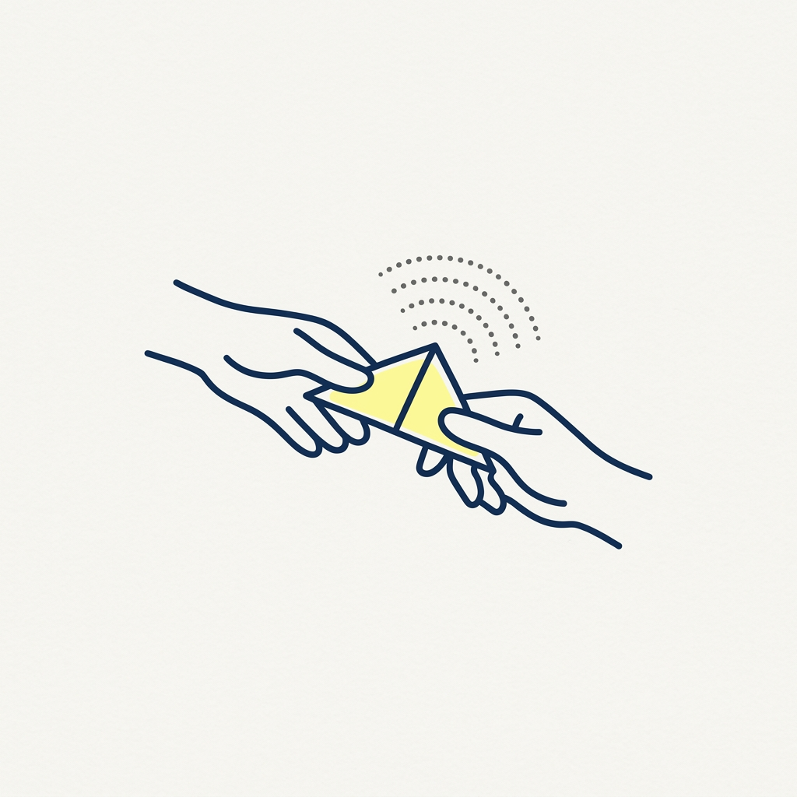

<div align="center">



# SinDatosMaje

**Transferencia de archivos P2P para el aula — sin internet, sin datos, sin excusas.**

*El clásico papelito pasado bajo el pupitre, pero en versión digital P2P.* 🇳🇮

[](https://python.org)
[](https://djangoproject.com)
[](https://webrtc.org)
[](#instalación-como-app)
[](LICENSE)

</div>

---

## El Problema

En muchas aulas de Latinoamérica el internet es lento, inestable o simplemente no existe. Cuando un profesor necesita compartir un PDF, una foto de la pizarra o una presentación con 30 alumnos, las opciones habituales (WhatsApp, Google Drive, correo) **requieren datos móviles que la mayoría no tiene**.

## La Solución

**SinDatosMaje** convierte cualquier laptop en un servidor local de transferencia directa. Solo necesitas una red Wi-Fi (puede ser el hotspot de un celular **sin saldo ni internet**). El profesor suelta el archivo, los alumnos escanean un QR o escriben un código de 6 letras, y el archivo viaja **directo de dispositivo a dispositivo** por WebRTC sin tocar ningún servidor externo.

---

## Características

| Característica | Detalle |
|---|---|
| **100% Offline** | Funciona en redes Wi-Fi sin acceso a internet |
| **Transferencia P2P** | WebRTC `RTCDataChannel` — velocidad LAN completa (50–300 Mbps) |
| **Privacidad total** | Los archivos nunca salen de la red local |
| **PWA instalable** | Se instala como app nativa en Android, iOS y Windows |
| **Sin CDNs externos** | Tailwind, fuentes y librerías empaquetadas localmente |
| **UI Sketch-Note** | Interfaz estilo libreta escolar dibujada a mano |

---

## Arquitectura

```
Emisor (Laptop)                    Servidor Django                   Receptor (Celular)
      │                           (solo señalización)                      │
      │── 1. Suelta archivo ──────>│                                       │
      │<─ 2. Room ID + QR ────────│                                       │
      │── 3. Oferta SDP ─────────>│                                       │
      │                            │<── 4. Escanea QR / código ────────────│
      │                            │─── 5. Oferta SDP ───────────────────>│
      │                            │<── 6. Respuesta SDP ─────────────────│
      │<─ 7. Respuesta SDP ───────│                                       │
      │                                                                    │
      │═══════════ 8. Conexión P2P directa vía Wi-Fi local ═══════════════│
      │──────────── Archivo en chunks de 32 KB ──────────────────────────>│
      │                    (cero datos, cero internet)                     │
```

### Componentes Clave

**Backend — [`core/views.py`](core/views.py)**
- Almacén de salas en memoria thread-safe (`threading.Lock()`)
- Auto-descubrimiento de IP local de la tarjeta de red
- Reescritura automática de hostnames mDNS `.local` a IP LAN real
- Códigos de sala en mayúsculas sin caracteres ambiguos (`0/O`, `1/I`)

**Frontend — [`core/template/core/index.html`](core/template/core/index.html)**
- Fragmentación de archivos en chunks de 32 KB con `FileReader`
- Control de backpressure vía `bufferedAmountLowThreshold`
- Reensamblado y descarga automática con `Blob` + `URL.createObjectURL`

**PWA — [`static/sw.js`](static/sw.js)**
- Service Worker con estrategia Cache-First para el App Shell
- Bypass estricto de `/api/*` para señalización en vivo

---

## Estructura del Proyecto

```
SinDatosMaje/
├── config/                    # Configuración Django (settings, urls, wsgi)
├── core/
│   ├── template/core/
│   │   └── index.html         # Interfaz completa (HTML + JS + Sketch-Note CSS)
│   ├── views.py               # Señalización WebRTC y handlers PWA
│   └── urls.py                # Rutas /api/ y PWA
├── static/
│   ├── css/fonts.css          # @font-face locales (Patrick Hand, JetBrains Mono)
│   ├── fonts/                 # 15 archivos .woff2
│   ├── icons/                 # icon.svg, icon-192.png, icon-512.png
│   ├── vendor/                # tailwind.js, qrcode.min.js, html5-qrcode.min.js
│   ├── manifest.json          # Manifiesto PWA
│   └── sw.js                  # Service Worker Cache-First
├── manage.py
└── README.md
```

---

## Inicio Rápido

### Requisitos

- Python 3.10+
- Django 5+ (`pip install django`)

### Instalación y Ejecución

```bash
# 1. Clonar el repositorio
git clone https://github.com/freddyguevara085-stack/SinDatosMaje.git
cd SinDatosMaje

# 2. Crear y activar entorno virtual
python -m venv venv
venv\Scripts\activate          # Windows
# source venv/bin/activate     # Linux / macOS

# 3. Instalar Django
pip install django

# 4. Iniciar el servidor en la red local
python manage.py runserver 0.0.0.0:8000
```

Abre `http://localhost:8000/` en tu laptop. Los alumnos se conectan a `http://<TU-IP>:8000/` desde sus celulares.

---

## Uso en el Aula

### Paso 1 — Crear la red

Conecta laptop y celulares a la **misma red Wi-Fi**. Puede ser:
- Un router común (con o sin internet)
- El hotspot de un celular (**sin saldo ni datos**)

### Paso 2 — Compartir (Profesor)

1. Abre la app en tu laptop
2. Arrastra o selecciona el archivo (foto, PDF, presentación)
3. Se genera un **código QR** y un **código de sala de 6 letras**

### Paso 3 — Recibir (Alumno)

1. Escanea el QR con la cámara de su celular, **o**
2. Abre la app y escribe el código de 6 letras
3. El archivo se descarga directo — **cero megas consumidos**

---

## Notas de Compatibilidad

| Situación | Solución |
|---|---|
| **Cámara bloqueada en HTTP** | Los navegadores móviles bloquean la cámara en `http://` por IP. El alumno puede usar la app de cámara nativa para escanear el QR, o escribir el código de 6 letras manualmente. |
| **Archivos grandes** | Recomendado hasta **200 MB** (fotos, PDFs, presentaciones). En celulares de gama baja, archivos mayores pueden agotar la RAM del navegador. |
| **Misma sala en dos pestañas** | Cada pestaña del mismo dispositivo comparte la misma conexión WebRTC. Usa el botón *Salir de la sala* antes de unirte de nuevo. |

---

## Tecnologías

| Tecnología | Uso |
|---|---|
| **Django** | Servidor de señalización ligero y App Shell |
| **WebRTC** | Conexión P2P directa entre dispositivos vía `RTCDataChannel` |
| **Service Worker** | Caché offline del App Shell (estrategia Cache-First) |
| **Tailwind CSS** | Maquetación responsiva (empaquetado localmente) |
| **QRCode.js** | Generación de códigos QR en el navegador |
| **html5-qrcode** | Lectura de QR vía cámara del dispositivo |

---

## Instalación como App

SinDatosMaje es una **Progressive Web App**. En dispositivos compatibles aparecerá un banner amarillo invitando a instalarla. También puedes:

- **Android Chrome:** Menú ⋮ → *Instalar aplicación*
- **iOS Safari:** Compartir → *Agregar a pantalla de inicio*
- **Windows Edge/Chrome:** Ícono de instalación en la barra de direcciones

Una vez instalada, la app carga instantáneamente desde caché, incluso sin conexión.

---

## Licencia

MIT — Libre para usar, modificar y distribuir.

Desarrollado para facilitar el acceso a la educación y el intercambio de conocimiento sin barreras de conectividad.
